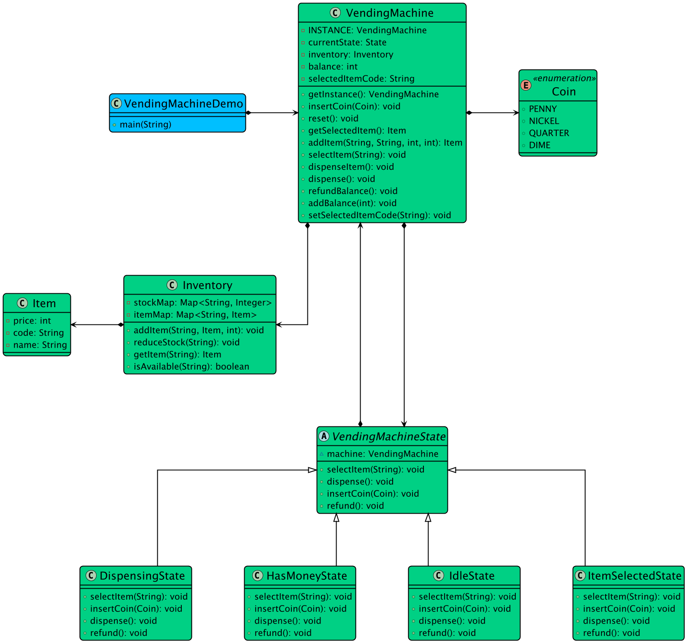

# Vending Machine (LLD)

## Problem Statement

Design and implement a Vending Machine system that allows users to select products, insert coins/notes, dispense products, and return change. The system should manage inventory, handle payments, and use the State design pattern for its operations.

---

## Requirements

- **Product Management:** The system manages a catalog of products, each with a price and available quantity.
- **Inventory Management:** The system tracks the quantity of each item and prevents dispensing if out of stock.
- **Payment Handling:** The system accepts coins and notes, tracks total payment, and returns change if necessary.
- **State Management:** The system uses the State design pattern to manage its operational states (Idle, Ready, Dispense, ReturnChange).
- **User Interaction:** Users can select products, insert coins/notes, and receive products and change.
- **Extensibility:** Easy to add new item types, payment methods, or states.

---

## Core Entities

- **VendingMachine:** Main class that manages inventory, vendingMachineState transitions, item selection, and payment.
- **Product:** Represents a item with a name and price.
- **Inventory:** Manages the stock of products.
- **Coin / Note:** Represents accepted denominations for payment.
- **VendingMachineState (interface):** Interface for different machine states.
- **IdleState, ReadyState, DispenseState, ReturnChangeState:** Concrete states implementing VendingMachineState.
- **Singleton Pattern:** VendingMachine is implemented as a singleton.

---

## Class Design

## UML Class Diagram



### 1. VendingMachine
- **Fields:** Inventory inventory, VendingMachineState idleState, readyState, dispenseState, returnChangeState, currentState, Product selectedProduct, double totalPayment
- **Methods:** addProduct(String, double, int), selectProduct(Product), insertCoin(Coin), insertNote(Note), dispenseProduct(), returnChange(), setState(VendingMachineState), getInstance(), etc.

### 2. Product
- **Fields:** String name, double price

### 3. Inventory
- **Fields:** Map<Product, Integer> productQuantities
- **Methods:** addProduct(Product, int), getQuantity(Product), reduceQuantity(Product), isAvailable(Product)

### 4. Coin / Note
- **Fields:** double value
- **Methods:** getValue()

### 5. VendingMachineState (interface)
- **Methods:** selectProduct(Product), insertCoin(Coin), insertNote(Note), dispenseProduct(), returnChange()

### 6. IdleState, ReadyState, DispenseState, ReturnChangeState
- **Implements:** VendingMachineState
- **Behavior:** Each vendingMachineState handles allowed operations and transitions.

---

## Example Usage

```java
VendingMachine machine = VendingMachine.getInstance();
Product chips = machine.addProduct("Chips", 1.5, 10);
machine.selectProduct(chips);
machine.insertCoin(new Coin(1.0));
machine.insertCoin(new Coin(0.5));
machine.dispenseProduct();
machine.returnChange();
```

---

## Demo

See your main or demo class for a sample usage and simulation of the vending machine.

---

## Extending the Framework

- **Add new payment methods:** Support for cards, mobile payments, etc.
- **Add new states:** Maintenance, OutOfOrder, etc.
- **Add item categories:** Snacks, drinks, etc.

---

## Design Patterns Used

- **State Pattern:** For managing machine states and transitions.
- **Singleton Pattern:** For ensuring a single instance of the VendingMachine.

---